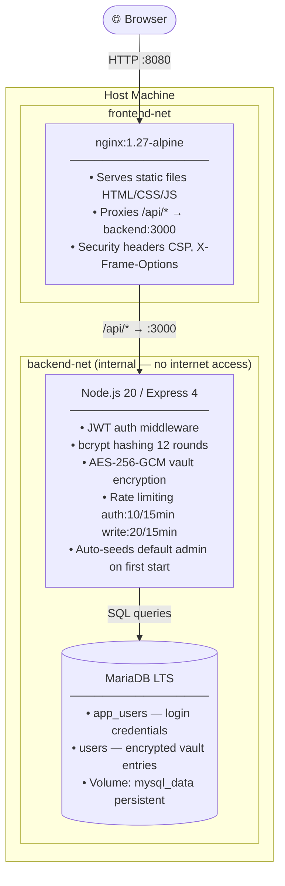

# Password Manager

A self-hosted, encrypted password manager with per-user vaults, admin controls, and JWT authentication. Runs entirely in Docker.

---

## Features

- **Encrypted storage** — passwords at rest are encrypted with AES-256-GCM
- **Per-user vaults** — each user sees only their own saved entries
- **JWT authentication** — stateless, 8-hour sessions with automatic inactivity logout after 2 minutes
- **Password generator** — cryptographically random 20-character passwords with strength meter
- **Forgot password** — users can reset their own password from the login page (no email required; requires knowing the username)
- **Admin panel** — admins can manage all registered users:
  - View all accounts with join date
  - Delete any user (cascades to their vault entries)
  - Force a user to change their password on next login
  - Download a full SQL backup of the database
  - Restore a previously downloaded SQL backup
- **Forced password change** — default admin and any admin-reset accounts must set a new password before accessing the app
- **Emergency admin reset** — `reset-admin-password.sh` script to recover the admin account from the host when the UI is inaccessible
- **Rate limiting** — brute-force protection on all auth and write endpoints
- **Security headers** — CSP, X-Frame-Options, X-Content-Type-Options via Nginx + Helmet

---

## Infrastructure

### Container Architecture



> `backend-net` is marked `internal: true` — the backend and database have no direct internet access. Only Nginx is exposed to the host.

### Docker Networks

| Network | Members | Internet Access |
|---|---|---|
| `frontend-net` | nginx | Yes (via host port 8080) |
| `backend-net` | nginx, backend, mariadb | No (internal) |

### Request Flow

```
Browser
  │
  │  HTTP :8080
  ▼
Nginx (nginx:1.27-alpine)
  │
  ├── GET /               → serve login.html (static)
  ├── GET /index.html     → serve index.html (static)
  ├── GET /style.css      → serve style.css  (static)
  │
  └── /api/*  ──────────► Express Backend (:3000)
                              │
                              ├── POST /api/auth/login
                              ├── POST /api/auth/register
                              ├── POST /api/auth/reset-password
                              ├── POST /api/auth/change-password  [JWT required]
                              ├── GET  /api/passwords             [JWT required]
                              ├── POST /api/passwords             [JWT required]
                              ├── DELETE /api/passwords/:id       [JWT required]
                              ├── GET  /api/admin/users           [JWT + admin]
                              ├── DELETE /api/admin/users/:id     [JWT + admin]
                              ├── POST /api/admin/users/:id/reset-password  [JWT + admin]
                              ├── GET  /api/admin/backup          [JWT + admin]
                              └── POST /api/admin/restore         [JWT + admin]
```

### Database Schema

```
app_users                          users
─────────────────────────────      ────────────────────────────────
id            INT UNSIGNED PK      id            INT UNSIGNED PK
username      VARCHAR(64) UNIQUE   user_id       INT UNSIGNED FK ──► app_users.id
is_admin      TINYINT(1)           website       VARCHAR(255)
must_change_password TINYINT(1)    username      VARCHAR(64)
password_hash VARCHAR(255)         password      VARCHAR(255)  ← AES-256-GCM
created_at    TIMESTAMP            created_at    TIMESTAMP

                                   ON DELETE CASCADE
```

---

## Authentication Flow

```
┌──────────┐                  ┌─────────┐              ┌──────────────────┐
│  Browser │                  │ Backend │              │    Database      │
└────┬─────┘                  └────┬────┘              └────────┬─────────┘
     │                             │                            │
     │  POST /api/auth/login       │                            │
     │  { username, password }     │                            │
     │────────────────────────────►│                            │
     │                             │  SELECT id, is_admin,      │
     │                             │  must_change_password,     │
     │                             │  password_hash             │
     │                             │  WHERE username = ?        │
     │                             │───────────────────────────►│
     │                             │◄───────────────────────────│
     │                             │                            │
     │                             │  bcrypt.compare()          │
     │                             │  (always runs — timing     │
     │                             │   attack protection)       │
     │                             │                            │
     │  200 { token, isAdmin,      │                            │
     │        mustChangePassword } │                            │
     │◄────────────────────────────│                            │
     │                             │                            │
     │  mustChangePassword=true?   │                            │
     │  → redirect: change-password.html                        │
     │                             │                            │
     │  mustChangePassword=false?  │                            │
     │  → redirect: index.html     │                            │
     │                             │                            │
     │  Subsequent requests:       │                            │
     │  Authorization: Bearer JWT  │                            │
     │────────────────────────────►│                            │
     │                             │  jwt.verify(token,         │
     │                             │    { algorithms: ['HS256']}│
     │                             │  → req.user = { id,        │
     │                             │    username, isAdmin }     │
```

---

## Quick Start

### Prerequisites

- Docker Engine 24+
- Docker Compose v2

#### Install Docker

**Linux (Debian / Ubuntu)**
```bash
curl -fsSL https://get.docker.com | sh
sudo usermod -aG docker $USER   # log out and back in after this
```

**macOS**
Download and install [Docker Desktop](https://www.docker.com/products/docker-desktop/). Docker Compose is bundled.

**Windows**
Download and install [Docker Desktop](https://www.docker.com/products/docker-desktop/). Enable WSL 2 backend when prompted. Docker Compose is bundled.

Verify the installation:
```bash
docker --version          # Docker version 24.x or later
docker compose version    # Docker Compose version v2.x or later
```

### 1 — Clone and configure

```bash
git clone <repo-url>
cd passWord
cp .env.example .env
```

Edit `.env` and set strong values for every variable (see [Configuration](#configuration)).

### 2 — Start the stack

```bash
docker compose up -d
```

On first start the backend will log:

```
[seed] Default admin created — username: admin, password: password (must change on first login)
```

### 3 — Open the app

Navigate to `http://localhost:8080`

You will be redirected to the login page. Log in with:

| Field | Value |
|---|---|
| Username | `admin` |
| Password | `password` |

You will be immediately redirected to the **Change Password** page. Set a strong password (12–20 characters, must include uppercase, lowercase, number, and special character) before you can access the app.

---

## Configuration

Copy `.env.example` to `.env` and fill in all values before starting.

| Variable | Description | Example |
|---|---|---|
| `MYSQL_ROOT_PASSWORD` | MariaDB root password (also used by the restore route) | `ch@ngeMe_r00t!` |
| `MYSQL_DATABASE` | Database name | `password_app` |
| `MYSQL_USER` | Application DB user | `appuser` |
| `MYSQL_PASSWORD` | Application DB password | `ch@ngeMe_app!` |
| `ENCRYPTION_KEY` | 64-hex-char AES-256-GCM key for vault entries | `openssl rand -hex 32` |
| `JWT_SECRET` | 64-hex-char HMAC-SHA256 signing secret | `openssl rand -hex 32` |
| `NODE_ENV` | Node environment | `production` |

Generate secrets:

```bash
openssl rand -hex 32   # for ENCRYPTION_KEY
openssl rand -hex 32   # for JWT_SECRET
```

---

## Project Structure

```
passWord/
├── frontend/                  # Static files served by Nginx
│   ├── index.html             # Main app UI (vault + admin panel)
│   ├── login.html             # Login / Register page
│   ├── change-password.html   # Forced password change page
│   ├── forgot-password.html   # Self-service password reset page
│   ├── app.js                 # Main app logic (CRUD, password generation, admin panel)
│   ├── login.js               # Login / register logic
│   ├── change-password.js     # Password change logic
│   ├── forgot-password.js     # Password reset logic
│   └── style.css              # Dracula dark theme (Bootstrap 5 overrides)
│
├── backend/
│   ├── src/
│   │   ├── server.js          # Express app, middleware, routes, admin seed
│   │   ├── db.js              # MariaDB connection pool
│   │   ├── crypto.js          # AES-256-GCM encrypt/decrypt
│   │   ├── middleware/
│   │   │   ├── authenticate.js   # JWT verification → req.user
│   │   │   └── requireAdmin.js   # Admin-only guard
│   │   └── routes/
│   │       ├── auth.js           # login, register, change-password, reset-password
│   │       ├── admin.js          # user management, backup, restore
│   │       └── passwords.js      # CRUD for vault entries
│   ├── Dockerfile             # Multi-stage build (node:20-alpine)
│   └── package.json
│
├── mysql/
│   └── init/
│       └── 01_init.sql        # Schema creation (runs once on fresh volume)
│
├── nginx/
│   └── default.conf           # Reverse proxy + security headers
│
├── reset-admin-password.sh    # Emergency CLI script to reset the admin password
├── docker-compose.yml
├── .env.example
└── README.md
```

---

## Admin Panel

The admin panel is visible only to users with `is_admin = 1`. It replaces the standard vault UI for admin accounts.

### User Management

Each registered user appears in a table with their ID, username, join date, and two action buttons:

| Button | Action |
|---|---|
| Key icon (yellow) | Sets `must_change_password = 1` — user is redirected to the change-password page on their next login |
| Person-X icon (red) | Permanently deletes the user and all their saved vault entries (irreversible) |

Admins cannot delete or reset-password their own account from this panel.

### Database Backup

Click **Backup** to download a full SQL dump (`backup-<timestamp>.sql`) containing both the `app_users` and `users` tables. Rate-limited to 5 downloads per 15 minutes.

### Database Restore

Click **Choose…** to select a previously downloaded `.sql` backup file, then click **Restore** and confirm. This replays the full SQL dump against the live database — all current users and vault entries are overwritten. Rate-limited to 3 restores per 15 minutes.

> Only files generated by this application's backup feature are accepted. The restore route validates the file header before executing anything.

---

## Emergency Admin Reset

If the admin account password is lost and the UI is inaccessible, use the bundled shell script from the project root on the Docker host:

```bash
Linux

./reset-admin-password.sh
# or for a different admin username:
./reset-admin-password.sh someadmin
```

The script:
1. Prompts for a new password (same complexity rules as the UI)
2. Generates the bcrypt hash inside the running backend container (no host-side dependencies)
3. Updates the database and sets `must_change_password = 1`

The backend and database services must be running (`docker compose up -d`).

---

## API Reference

All `/api/passwords` and `/api/admin` endpoints require `Authorization: Bearer <token>`.

### Auth (public, rate-limited to 10 req / 15 min)

| Method | Path | Body | Response |
|---|---|---|---|
| `POST` | `/api/auth/register` | `{ username, password }` | `201` or `409` / `422` |
| `POST` | `/api/auth/login` | `{ username, password }` | `200 { token, username, isAdmin, mustChangePassword }` |
| `POST` | `/api/auth/reset-password` | `{ username, password }` | `200` or `404` / `422` |
| `POST` | `/api/auth/change-password` | `{ currentPassword, password }` | `200` or `401` / `422` — requires JWT |

### Vault (JWT required)

| Method | Path | Description |
|---|---|---|
| `GET` | `/api/passwords` | List current user's entries |
| `POST` | `/api/passwords` | Save a new entry |
| `DELETE` | `/api/passwords/:id` | Delete an entry (owner only) |

### Admin (JWT + admin required)

| Method | Path | Description |
|---|---|---|
| `GET` | `/api/admin/users` | List all registered users |
| `DELETE` | `/api/admin/users/:id` | Delete a user and all their entries |
| `POST` | `/api/admin/users/:id/reset-password` | Force user to change password on next login |
| `GET` | `/api/admin/backup` | Download a full SQL dump (rate-limited: 5 / 15 min) |
| `POST` | `/api/admin/restore` | Restore a SQL backup file (rate-limited: 3 / 15 min) |

### Password Rules (register, change-password, reset-password)

- 12–20 characters
- At least one lowercase letter
- At least one uppercase letter
- At least one number
- At least one special character

---

## Security Notes

| Concern | Mitigation |
|---|---|
| Vault passwords at rest | AES-256-GCM with random IV per entry |
| Login credential storage | bcrypt (cost factor 12) |
| Username enumeration via timing | Constant-time dummy bcrypt compare when user not found |
| JWT algorithm confusion | `algorithms: ['HS256']` pinned in `jwt.verify` |
| Brute force | 10 failed auth attempts per IP per 15 min (`skipSuccessfulRequests: true`) |
| Session inactivity | Client-side auto-logout after 2 minutes of inactivity |
| Clickjacking | `X-Frame-Options: SAMEORIGIN` |
| MIME sniffing | `X-Content-Type-Options: nosniff` |
| XSS via CDN | CSP restricts scripts/styles to `self` + `cdn.jsdelivr.net` |
| DB network exposure | `backend-net` is Docker-internal; MariaDB not reachable from host |
| Container privilege | Backend runs as non-root `appuser` inside the container |
| Self-deletion by admin | Server rejects `DELETE /api/admin/users/<own-id>` with 400 |
| Backup restore abuse | Restore endpoint rate-limited (3/15 min); only accepts files with the application's backup header |
| Restore privilege | Restore uses a root DB connection scoped to a single transaction — `MYSQL_ROOT_PASSWORD` required in `.env` |

---

## Stopping and Resetting

```bash
# Stop containers (data preserved)
docker compose down

# Stop and delete all data (wipe the database volume)
docker compose down -v
```

After a full wipe, the next `docker compose up` will re-seed the default admin.
